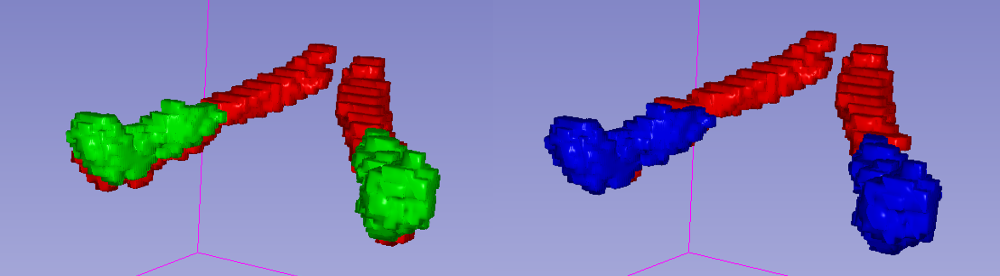
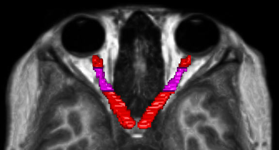
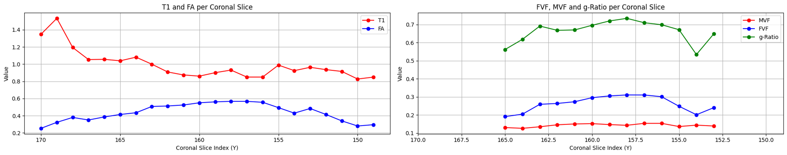
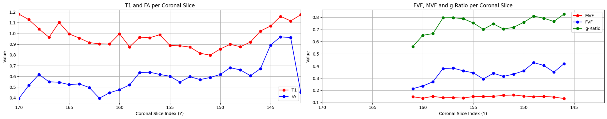

# g-Ratio mapping of the optic nerve
## About me
<a href="https://github.com/haplante">
   
   <br /><sub><b>Hugo Albert Plante</b></sub>
</a>

I am a second-year undergraduate student in Biomedical Engineering at Polytechnique Montreal. I am passionate about science and guided by the belief that “impossible only means that you haven’t found the solution yet.” This mindset drives me to approach challenges with curiosity and persistence, always eager to discover innovative solutions that can make a difference. 

Attending BHS as an undergraduate student was not a simple task, but it made the experience even more rewarding. My goal in participating was to kickstart part of my internship project, focused on developing a vendor-neutral g-ratio protocol for the optic nerve.

## Project summary

### Introduction
This project focuses on quantifying myelin integrity in the optic nerve using multimodal MRI. Multiple Sclerosis (MS) causes degradation of the myelin sheath surrounding nerve fibers, impairing neural communication (Ausmed, 2025). Measuring key parameters such as the **g-ratio**, **Myelin Volume Fraction (MVF)**, and **Fiber Volume Fraction (FVF)** enables better understanding and monitoring of demyelination. 

Using MRI-derived maps like T1 and FA, this project aims to compute these metrics non-invasively, providing valuable insights for reasearch and clinical applications in neurological disorders like MS.

### Background

#### Multiple Sclerosis and Neuronal Structure
Multiple sclerosis (MS) is an autoimmune disease that affect 2.8 millions peoples worldwide, as of 2020 (MS Canada, 2025). This disease occur when the body’s immune system mistakenly attack the myelin sheath, causing demyelination. A common early symptom of multiple sclerosis is optic neuritis, but as of 2024, it has also become a McDonald criteria for diagnosing MS (MS Trust, 2024). 

#### g-Ratio: A key Metric in Myelin Studies
the g-ratio is a crucial parameter for quantifying the relative thickness of the myelin sheath. It is defined as the ratio between the inner axonal radius (r) and the outer myelinated radius (R) of a nerve fiber:

$$g=\frac{r}{R}$$

This ratio provides into myelin integrity and neuronal health. 

#### Volume Fractions and their significance
* **Myelin Volume Fraction (MVF)** represents the proportion of myelin in a given tissue volume.
* **Fiber Volume Fraction (FVF)** represents the proportion of nerve fibers (axons plus myelin) in a given tissue volume. 
* **Macromolecular Tissue Volume Fraction (MTVF)** represents the proportion of macromolecules (including myelin) in a given tissue volume.
* The relation between MVF and FVF relates directly to the g-ratio (Stikov et al., 2015):

$$\frac{MVF}{FVF}=1-g^2$$

Using two MRI modalities, MVF and FVF can be calculated non-invasively.
#### Imaging Techniques and Quantitatives Maps
* Macromolecular Tissue Volume Fraction is used as an indirect measure of myelin content. In white matter like the optic nerve, myelin composition approximatively 50% of MTVF (Mezer et al., 2013). It has been shown that MTVF can be derived from the actual value of T1 in an MRI voxel (Mezer et al., 2013):

$$\frac{1}{1-MTVF}=\frac{0.44202}{T1}+0.94766$$

* Fractionnal Anisotropy (FA) obtained from diffusion MRI, has shown have a quadratic relation FVF through simulations (Stikov et al., 2011):

$$FVF=0.883{FA}^2-0.082FA+0.074$$

These imaging-derived metrics allow assessment of neuronal integrity and demyelination in diseases like MS. 

### Main Objectives
* Develop a pipeline for mapping the g-ratio of the optic nerve
* Co-register MP2RAGE, DWI, and their derivatives to a common space (MNI 152)
* Compute g-ratio, MVF, and FVF from segmentations
* Calculate the mean g-ratio along each coronal slice of the optic nerve

## Personal Objectives
* Improve my programming skills through real-world application
* Familiarize myself with version control tools such as Git and GitHub
* Gain hands-on experience in data processing and medical image analysis
* Contribute to the development of scientific research in biomedical engineering

### Tools
* Jupyter notebooks for scripting
* BIDS standards for reproducibility and standardization
* Python for data vizualisation
* dMRI module and Spinal Cord Toolbox for inspiration
* **ANTs for image registration**
* 3D Slicer and FSLeyes for image visualization and ROI definition 
* Git and GitHub for Version Control
* Python Packages: 'matplotlib', 'nibabel', 'pandas', 'numpy'

### Data
The data used in this study comes for NYU Abu Dabi (private dataset), where the MP2RAGE and Diffusion MRI acquisitions were performed on 9 healty subjects. Manuals segmentations of the optic nerve were also perfromed for both modalities to extract the relevant MRI metrics.

For each subject, the dataset includes:
* A raw MP2RAGE image for T1 map extraction
* A denoised and defaced MP2RAGE UNI image
* A DWI b0 image for registration purposes
* A Fractional Anisotropy (FA) map obtained from a Siemens scanner
* Manual segmentations fro both MRI modalities

A supplementary critical part of the project was the analysis of a maximum probability label for the optic eye comming form (Barranco Hernandez et al., 2024). The goal of this integration was to determine wether the maximum probability label could be used as a automated segmentation alternative to manual segmentations. 

An exempale dataset will be upload to this GitHub repository once ethics approval from NYU has been obtained.

### Project Deliverables
* A non-invasive method for mapping the g-ratio along the optic nerve
* An executable, reproducible pipeline that tales multimodal MRI as an input and outputs the mean g-ratio along the optic nerve
* Jupyter Notebooks for data visualization and statistical metrics extraction
  
#### Future Deliverable
* Interactive tutorial-style NeuroLibre publication with interactive figures and data

### Methodology
1. Data Acquisition
The dataset was acquired using a MP2RAGE and Diffusion MRI sequences on a 3T Siemens scanner located at NYU Abu Dabi. Nine healthy subjects were scanned, with manual segmentations of the optic nerve performed on both modalities for ground-truth extraction.

2. Preprocessing
Raw MP2RAGE UNI images were denoised and defaced to facilitate manual segmentation and registration. The denoising process reduces background noise that can interfere with the registration. Native FA maps provided by the scanner were used directly for FVF calculation. However, the FA map extraction and diffusion MRI preprocessing could be done with the diffusion MRI module's preprocessing Jupyter Notebook (Brainhack School, n.d.) or Naghizadeh_project preprocessing pipeline (Naghizadeh, 2025). 

3. Image Registration
Accurate co-registration between MP2RAGE and DWI is critical due to the small size (~4-5 voxels wide) and the natural curvature of the optic nerve. Multiples registration strategies were tested, including rigid, affine, and elastic transformations, to optimize alignment while preserving anatomical integrity. Elastic registration method tended to deform the optic nerve, resulting in segmentations inconsistencies, such as hole within manual masks. Ultimately, a combined rigid and affine registration approach was selected as the optimal balance between alignment and standardization to a template (MNI152).

Additionally, another registration challenge occured because the DWI acquisitions covered only a slab including the optic nerve. This restriction made the aligment with the MP2RAGE full volume more complicated.

4. Parameters Extraction
Quatitative MRI parameters were extracted voxel-wise within the overlapping of both MRI modalities segmentation. This overlapping approach was necessary because DWI images are more noisier, producing bulkier segmentation compared to the more precise MP2RAGE segmentation. T1 relaxation maps, obtained from MP2RAGE through qMRLab (qMRLab, n.d.), were used to compute the MTVF via the established formula. The MVF was then calculated by combining the MTVF values with the assumed myelin composition of the tissue. Native extracted FA values were converted to FVF using the quadratic relation derived form simulation (Stikov et al., 2011).

5. Modeling and Analysis
The mean myelin volume fraction and mean fiber volume fraction were then used to calculate the mean g-ratio value along each coronal slice of the optic nerve. 

6. Visualization and Output
The final pipeline outputs include:
* Coronal slice-wise plot of MVF, FVF, and g-ratio in a standardized (MNI152) space
* Statistics metrics from each coronal slice including the dice coefficient between both modalities segmentations

## Results
Since the dataset segmentations were not all completed by the submission date, the results presented here focus on only two subjects. 

### Image registration using [registration.ipynb](script/registration.ipynb)
The 'registration.ipynb' Jupyter Notebook contains the full registration workflow, starting from the raw MP2RAGE and DWI images and producing standardized results in the MNI 152 space.

The first cell of the pipeline sets up the bash environment variables and creates the necessary directories. As the project follows the BIDS data structure standard, each subject's files should follow a directory tree similar to the example below:
<details>
  <summary>Project Directory Structure (click to expand)</summary>
```plaintext
project_root/
└── data/
    ├── sub-XXX/    
    │   ├── anat/
    │   │   └── sub-XXX_T1w.nii.gz
    │   └── dwi/
    │       └── sub-XXX_dwi.nii.gz
    │
    └── derivatives/
        ├── t1_map/
        │   └── sub-XXX/
        │       └── sub-XXX_t1_map.nii.gz
        ├── fa_map/
        │   └── sub-XXX/
        │       └── sub-XXX_scanner_FA.nii.gz
        ├── optic_nerve_segmentations/
        │   └── sub-XXX/
        │       ├── anat/
        │       │   └── sub-XXX_label-ON_seg.nii.gz
        │       └── dwi/
        │           └── sub-XXX_label-ON_seg.nii.gz
        │  
        └── templates/
            ├── MNI152_T1_1mm.nii.gz
            ├── Atlas_MNI.nii.gz
            └── Optic_Nerve_Label_MNI.gz
```
</details>

Within this data structure, the only environment variables that require customization are 'PROJECT_ROOT' and 'SUBJECT'. In this project, manual segmentations were performed directly on pre-rigidly registered DWI images, but the raw DWI image can also be used. Temporary derivative files are created in a designated directory, which can be safely deleted once the final results files are generated.

For each registration step, the type of registration can be easily modified in the notebook by changing the value the '-t' parameter (REF) to:
* 'r' for rigid 
* 'a' for affine
* 's' for nonlinear elastic (SyN) registration

The pipeline proceeds as follows: 
1. Rigid registration of DWI (automaticaly the b0 volume) to MP2RAGE
2. Affine registration of MP2RAGE to MNI 152 template
3. Application of transformations to:
* DWI to MNI
* DWI segmentation to MP2RAGE then to MNI
* FA map to MP2RAGE then to MNI
* MP2RAGE segmentation to MNI
* T1 map to MNI
4. Creation of standardized Regions of Interest (ROIs) for DWI and MP2RAGE in MNI 152 space
5. Rigid registration of DWI ROI to MP2RAGE ROI (secondary alignment)
6. Application of ROI transfromations to DWI, DWI segmentation, and FA map
7. Generation of final results files
8. Optional: Deletion of the temporary working directory

Step 4 and 5 are necessary because the initial registration introduced an offset in the segmentations. Therefore, the ROI co-registration step corrects this misalignement, as illustrated in the example below: red represents the MP2RAGE segmentation, green represents the DWI segmentation after the initial alignment, and blue represents the DWI after the ROI alignment correction.



Additionally, outlying values were identified near the edges of both manual segmentations. To ensure plausible values along the optic nerve, Regions of Interest (ROIs) were defined, as illustrated in the example figure below. 



### Data visualization using [data_visualization.ipynb](script/data_visualization.ipynb)

Assuming that the results directory and files were generated sucessfully, the only variable that need to be modified in the notebook are 'PROJECT_ROOT' and 'SUBJECT'.

The main steps in the data visualization workflow are as follow: 
1. Load results files based on the specified 'PROJECT_ROOT' and 'SUBJECT'.
2. Extract various slice-wise metrics, including slice index, number of voxels in each segmenation, number of overlapping voxels, Dice coefficient, as well as the mean and standard deviation of T1 and FA values.
3. Compute slice-wise MVF, FVF, and g-ratio using detailed equations and underlying assumptions.
4. Summarize relevant metrics that characterize the overlap between segmentations.
5. Generate plots showing the slice-wise mean of T1, FA, FVF, MVF, and g-ratio, for visual interpretation

### Segmentation Overlap Metrics Summary

| Metric                          | Subject 1           | Subject 2           |
|--------------------------------|---------------------|---------------------|
| Number of slices analyzed       | 32                  | 22                  |
| Dice coefficient (mean ± std)   | 0.4961 ± 0.1703     | 0.3958 ± 0.1234     |
| Average overlapping voxels/slice| 20.8                | 19.0                |
| T1 values inside overlap (mean ± std, s) | 0.99 ± 0.13        | 0.99 ± 0.17        |
| FA values inside overlap (mean ± std) | 0.5886 ± 0.1408     | 0.4370 ± 0.1013     |
| Mean MTVF (mean ± std)          | 0.2736 ± 0.0278     | 0.2751 ± 0.0338     |
| Mean MVF (mean ± std)           | 0.1368 ± 0.0139     | 0.1375 ± 0.0169     |
| Mean FVF (mean ± std)           | 0.3486 ± 0.1594     | 0.2154 ± 0.0680     |
| Mean g-ratio (mean ± std)       | 0.7329 ± 0.1019     | 0.5781 ± 0.1614     |

### Results – MVF, FVF & g-Ratio
Additionally

#### Subject 0204



#### Subject 0457



## Conclusions

### Can we visualize the g-ratio value along the optic nerve?
Yes. Using the developed pipeline, we successfully mapped and visualized the g-ratio values along the optic nerve in a reproducible and non-invasive manner. This provides meaningful insight into myelin integrity and fiber composition in differents subjects.

### Encountered issues
#### Registration issue

#### MTVF vs MVF

### Guide to Reproducibility
This project follows the BIDS data structure for standardized input. To reproduce results:
1. Set up the environment by sourcing 'env.sh'
2. Organize data according to BIDS format under 'PROJECT_ROOT'.
3. Modify subject variabes in the notebooks ('PROJECT_ROOT' and 'SUBJECT')
4. Run 'registration.ipynb' to co-register images and create results files
5. Run 'data_visualization.ipynb' to extract metrics and generate plots.
6. Optional: Clean temporary directories to save space.

## Troubleshooting
* Registration issues: Because the DWI is normally a slab, multiples rigid registration between DWI and MP2RAGE can be needed because the registration algorithm can fail.
* Missing dependencies: Ensure all Python packages and ANTs binairies are installed and accessible in your environment path.
* File path errors: Verify your BIDS directory structure and that environment variables point to correct locations.
* Plotting errors: Create the metrics dataframe before visualization.
  
## Acknowledgement

## References
